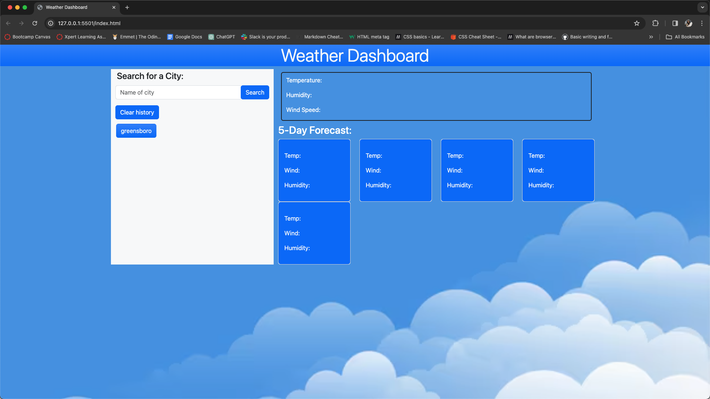
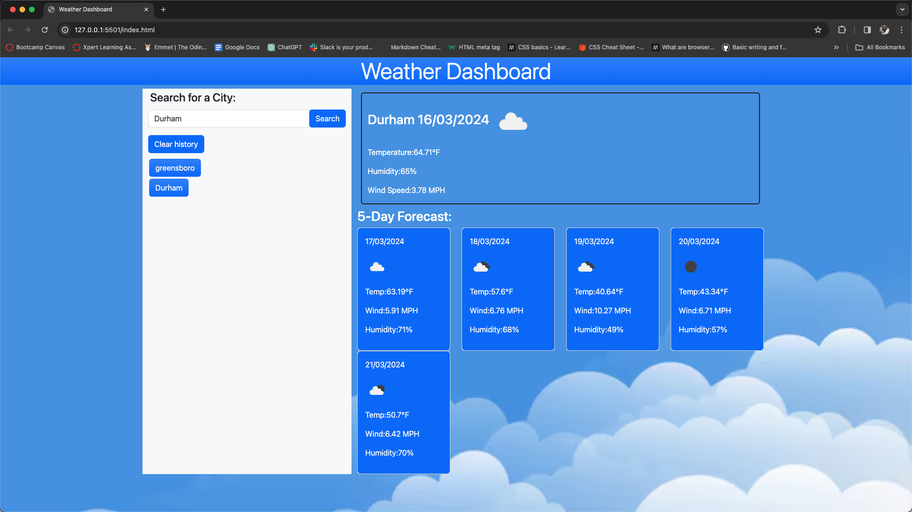

## Weather Dashboard Project
# Description
This weather dashboard application will show you current and future weather conditions for that city. It is printed with the current and future conditions for that current city. It will also store the search city. It shows the city name, the date, an icon representation of weather conditions, the temperature, the humidity, and the the wind speed. It also displays a 5-day forecast that displays the date, an icon representation of weather conditions, the temperature, the wind speed, and the humidity. You can also click on the search history and again it will present with current and future conditions for that city.

Click to see the weather : [Click here](https://jujunakarmi.github.io/Weather-dashboard/)

Here are some of the screenshots:

# Usage
This weather dashboard application is very user friendly app. Just type in the name of the country or any city you want to check the weather for. Click on the search button just next to it. It will show you the name of the desired city current date, current temperature in Fahrenheit, Humidity, Wind speed in MPH. Just below that you can see the weather forecast for upto 5 days which also includes date, current temperature in Fahrenheit, Humidity, Wind speed in MPH. And the best thing is that it does have a local storage set up that means whatever you searched for it will be saved in the history and you have option to click it again and rewatch the whole thing again and you can also clear the history of you want to.

# License
&copy; Copyright 2024 Juju Nakarmi
